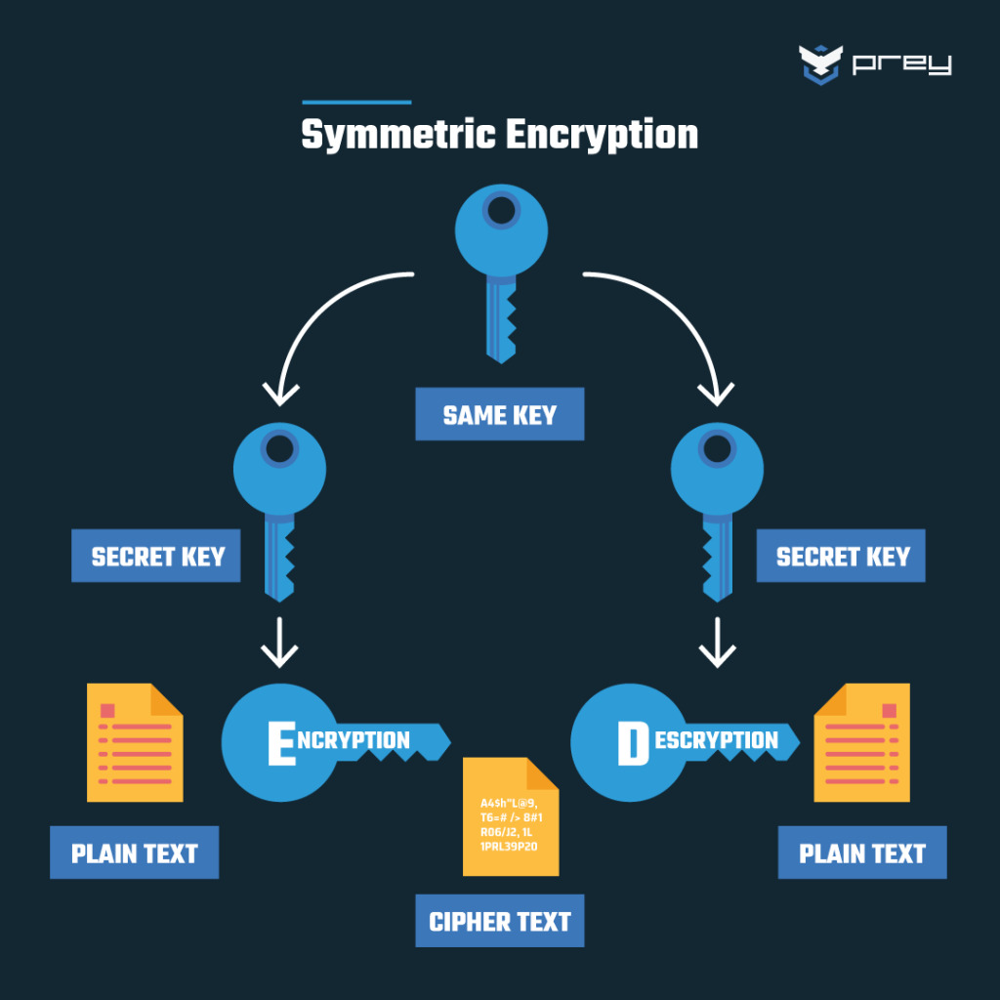

### INTRODUCTION

RSA Algorithm is based on **factorisation** of large number and **modular arithmetic** for encrypting and decrypting data. 
It consists of three main steps :
1. Key Generation 
2. Encryption 
3. Decryption 

### STEPS  
#### 1. KEY GENERATION
##### 1. The Secret Foundation (Choosing Primes) 

The process starts with two numbers that must be kept secret:

- **Choose Two Large Prime Numbers (p and q):** These are the secret base of the entire system.
##### 2. The Shared Modulus (n)

This number forms a part of both keys and is public knowledge.

- **Calculate the Modulus (n):** Multiply the two secret primes together: n=p×q.

- **Role of n:** This large number is what makes the encryption secure. An attacker would need to factor n back into p and q to break the system, which is computationally infeasible for large numbers.

#### 3. The Exponents (e and d)

This step creates the encryption (e) and decryption (d) exponents. These two numbers are designed to be inverses of each other under a specific secret mathematical condition.

- **Choose the Public Exponent (e):** Select a small, common number (e). This number is chosen based on a specific property with the secret primes (p and q) that ensures the subsequent calculation of d is possible.    
- **Calculate the Private Exponent (d):** Calculate d using a special mathematical formula that involves **p and q** and the public exponent e.
- **The Key Relationship:** d is the number that completely reverses the mathematical operation performed by e. It works because it satisfies a required modular arithmetic property related to the prime factors p and q.
- **The requirement:** The calculation must ensure that **Decryption (d) is the modular inverse of Encryption (e)**.
 
#### Final Keys

Once the steps are complete, the keys are defined:

- **Public Key** (Shared with the World): (n,e)
- **Private Key** (Kept Secret): (n,d)

Now these complex maths that goes behind is already done by Web Crypto API's functions and we would use them readily to make our life a little easier.

#### 2.ENCRYPTION 

- When you encrypt data with a **Public Key** (n,e), the message (M) is first converted to a number. That number is **raised to the power of the public exponent (e)** and then the **remainder is taken by the modulus (n)**. The result is the unreadable **Ciphertext** (C).

						Ciphertext (C) = M^e(modn)

#### 3. DECRYPTION 
- For decryption, the we uses  **Private Key** (n,d). we **raise the ciphertext number (C) to the power of their private exponent (d)** and take the **remainder when divided by the modulus (n)**. This final number is the original message (M), which is then converted back to readable text.

						Original Message (M) = C^d(modn)

### WHY SECURE ? 
- RSA's security is based on the **Factoring Problem**: it's trivial to multiply two massive **secret prime numbers (p and q)** to get a large **public modulus (n)**. However, to break the encryption and find the secret key, an attacker must **reverse this process** by factoring n back into p and q. For the key sizes used today, this task is so computationally intensive that it is practically impossible with current technology.

