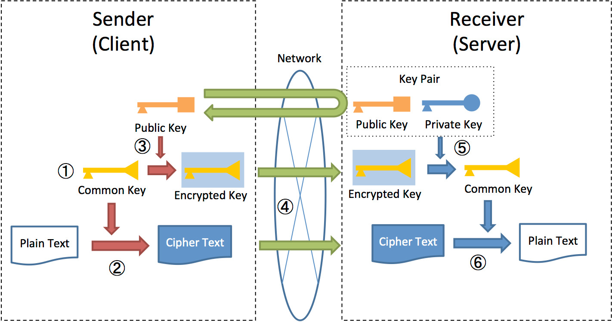

Now that we understand the fundamentals of **Asymmetric (RSA)** and **Symmetric (AES)** encryption algorithms, we can proceed with their implementation using the browser's built-in **Web Crypto API**.

Let us first understand the need for Hybrid Encryption 

- **Key Distribution Challenge:** Symmetric AES requires both users to have the **same secret key**. Since users can't meet to exchange it, **RSA is necessary to securely transmit that secret key** across the internet.

- **Performance Optimisation:** The slow, computation-heavy **RSA** is used only once for the _initial key delivery_, ensuring the **fast, efficient AES** is reserved for the bulk of _high-speed message transfer_.

- **Speed for Data (AES Strength):** AES is vastly **faster** than RSA. This speed is essential for quickly encrypting the large volume of data (every chat message) required for a responsive user experience.

- **Complete Confidentiality:** Using the RSA-secured channel to deliver the AES key guarantees that the **Session Key** is known only to the two communicating parties, achieving true **end-to-end confidentiality**.


- **Symmetric Encryption:** The sender first uses a fast **common Key (AES)** to encrypt the **Plaintext Message** into **Ciphertext**.

- **Asymmetric Key Transport:** The sender then uses the **recipient's Public Key (RSA)** to securely encrypt and transport that small **common Key** alongside the ciphertext.

- **Two-Step Decryption:** The recipient first uses their secret **Private Key (RSA)** to retrieve the **Session Key**, which is then used to decrypt the **Ciphertext** back into the original message.


Web Cypto API's has functions that do this job for us :
1. Generate keys (Sender side)

```js
export async function generateRSAKeyPair() {  
    try {  
        const keyPair = await window.crypto.subtle.generateKey(  
            {  
                name: "RSA-OAEP",  
                modulusLength: 2048,  // Key size  
                publicExponent: new Uint8Array([1, 0, 1]),  
                hash: "SHA-256"  
            },  
            true,  // Public key is extractable  
            ["encrypt", "decrypt"]  // Key usages  
        );  
  
        return keyPair;  // publicKey,privateKey  
    } catch (error) {  
        console.error("Error generating RSA key pair:", error);  
        throw error;  
    }  
}
```

- This function gives us the KeyPair(Private and Public key) by just specifying name of the mode (here RSA-OAEP) and we simply return it.

2. Encrypt AES key using RSA public key(Sender side)

```js
export async function wrapAESKeyWithRSA(aesKey, receiverPublicKey) {  
    try {  
        // Export AES key to raw format  
        const aesKeyRaw = await window.crypto.subtle.exportKey("raw", aesKey);  
  
        // Encrypt with RSA public key  
        const wrappedKey = await window.crypto.subtle.encrypt(  
            {  
                name: "RSA-OAEP"  
            },  
            receiverPublicKey,  
            aesKeyRaw  
        );  
  
        return arrayBufferToBase64(wrappedKey);  
    } catch (error) {  
        console.error("Error wrapping AES key:", error);  
        throw error;  
    }  
}
```

- For encrypting the AES Key we firstly convert it to Raw format(binary) and then encrypt it with receiver's Public Key.

3. Decrypt AES key using RSA private key(Receiver side)
	- This occurs after the message has been routed by the server to the receiver.

```js
export async function unwrapAESKeyWithRSA(wrappedKeyBase64, privateKey) {  
    try {  
        const wrappedKey = base64ToArrayBuffer(wrappedKeyBase64);  
        const aesKeyRawBuffer = await window.crypto.subtle.decrypt(  
            {  
                name: "RSA-OAEP"  
            },  
            privateKey,  
            wrappedKey  
        );  
	        // After decrypting,must import the raw buffer back into a CryptoKey              object  
        const aesKey = await window.crypto.subtle.importKey(  
            "raw", // Format of the key to import  
            aesKeyRawBuffer,  
            {  
                name: "AES-GCM",  
                length: 256  
            },  
            true, // Extractable  
            ["encrypt", "decrypt"]  
        );  
  
        return aesKey;  
    } catch (error) {  
        console.error("Error unwrapping AES key:", error);  
        throw error;  
    }  
}
```

- Encrypted AES key is base64 encoded as needed for transmission and after transforming  it into Raw format, we decrypt it using Receiver's Private Key and finally we convert it into CryptoKey format using the Import Key function.

#### We saw Key Generation, Encryption and Decryption for RSA  similarly we can do for AES.